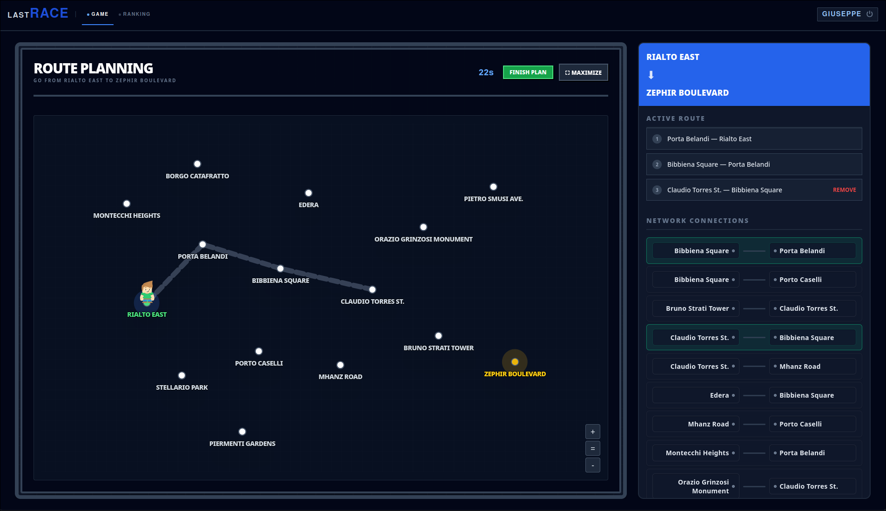
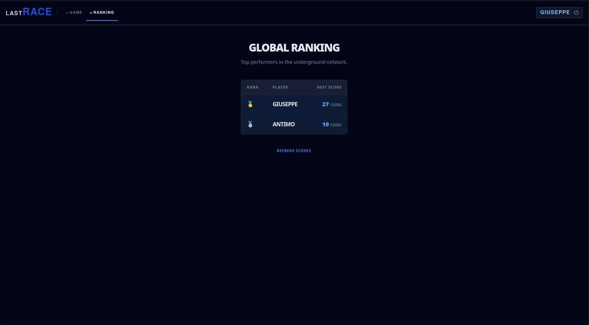

# Exam #1: "Last Race"
## Student: s338616 Bracciale Riccardo 

## React Client Application Routes

- Route `/`: Main gameplay view. If the user is logged in, it displays the interactive subway map, handles route planning, and plays the step-by-step journey animation. If the user is not logged in, it shows the game instructions and a link to the login page.
- Route `/login`: Login view. Handles user authentication.
- Route `/ranking`: Leaderboard view. Fetches and displays the global ranking of users based on their best scores achieved across all played games.
- Route `*`: Route that automatically redirects any unknown URL paths back to the root `/` page.

## API Server

### `POST /api/sessions`
* **Description**: Authenticates user credentials and starts a new session.
* **Returns**: A JSON object representing the logged-in user with their `id` and `username`.
* **Request Body**:
  ```json
  {
    "username": "giuseppe",
    "password": "webapp"
  }
  ```
* **Response (`200 OK`)**:
  ```json
  {
    "id": 1,
    "username": "giuseppe"
  }
  ```
* **Response (`401 Unauthorized`)**:
  ```json
  {
    "error": "Incorrect username or password."
  }
  ```

### `DELETE /api/sessions/current`
* **Description**: Logs out the currently authenticated user and destroys the session.
* **Returns**: Nothing (empty response body).
* **Request**: None.
* **Response (`204 No Content`)**: Empty response body.

### `GET /api/sessions/current`
* **Description**: Checks the authentication status and returns the currently logged-in user details.
* **Returns**: A JSON object representing the current user session with their `id` and `username`.
* **Request**: None.
* **Response (`200 OK`)**:
  ```json
  {
    "id": 1,
    "username": "giuseppe"
  }
  ```

### `GET /api/network`
* **Description**: Retrieves the complete transit network structure, including all stations and lines.
* **Returns**: A JSON object containing two main lists:
  - `stations`: An array of station objects, each containing its `id` and `name`.
  - `lines`: An array of line objects, each containing its `id`, `name`, and the ordered list of station IDs (`stations`) on that line.
* **Request**: None.
* **Response (`200 OK`)**:
  ```json
  {
    "stations": [
      { "id": 1, "name": "Pietro Smusi Ave." }
    ],
    "lines": [
      {
        "id": 1,
        "name": "Red Line",
        "stations": [1, 2, 3]
      }
    ]
  }
  ```

### `GET /api/events`
* **Description**: Retrieves all possible random transit events.
* **Returns**: A JSON array of event objects, each containing its `id`, a text `description`, and the score modifier `effect`.
* **Request**: None.
* **Response (`200 OK`)**:
  ```json
  [
    {
      "id": 1,
      "description": "Quiet journey",
      "effect": 0
    }
  ]
  ```

### `GET /api/ranking`
* **Description**: Retrieves the global leaderboard rankings (best score achieved by each user). Requires authentication.
* **Returns**: A JSON array of leaderboard entries, sorted by best score descending. Each entry contains the `username` and their `best_score`.
* **Request**: None.
* **Response (`200 OK`)**:
  ```json
  [
    {
      "username": "giuseppe",
      "best_score": 33
    }
  ]
  ```

### `POST /api/games`
* **Description**: Starts a new game by selecting random start/destination stations and storing start state in session. Requires authentication.
* **Returns**: A JSON object containing the game configuration:
  - `start`: The starting station object with its `id` and `name`.
  - `destination`: The target destination station object with its `id` and `name`.
* **Request**: None.
* **Response (`200 OK`)**:
  ```json
  {
    "start": { "id": 1, "name": "Pietro Smusi Ave." },
    "destination": { "id": 12, "name": "Borgo Catafratto" }
  }
  ```

### `POST /api/games/result`
* **Description**: Validates and executes the submitted route, saving the score result to the database and clearing the active session game. Requires authentication.
* **Returns**: A JSON object containing the simulation results:
  - `isInvalid`: Boolean indicating whether the route was physically invalid (disconnected or non-existent stations).
  - `score`: The final accumulated score.
  - `steps`: An array of leg-by-leg steps executed, where each leg contains `from` (origin station ID), `to` (destination station ID), `event` (event object if triggered), `coins` (current currency/score progress), `lineId` (the subway line ID used), and `isFailed` (whether this step failed).
  - `failReason`: A text description of the failure if the route failed, or `null`.
* **Request Body**:
  ```json
  {
    "route": [[1, 2], [2, 3]]
  }
  ```
* **Response (`200 OK`)**:
  ```json
  {
    "isInvalid": false,
    "score": 15,
    "steps": [
      {
        "from": 1,
        "to": 2,
        "event": { "id": 1, "description": "Quiet journey", "effect": 0 },
        "coins": 20,
        "lineId": 1,
        "isFailed": false
      }
    ],
    "failReason": null
  }
  ```
* **Response (`400 Bad Request`)**: Returned if no active game exists or if the route format is invalid.
  ```json
  {
    "error": "Invalid route format. Expected an array of station pairs: [[s1, s2], ...]"
  }
  ```
* **Response (`403 Forbidden`)**: Returned if the planning timer expired (elapsed time exceeded 95 seconds).
  ```json
  {
    "error": "Planning time exceeded"
  }
  ```

## Database Tables

### `users`
Stores user credentials and authentication details.
| Column | Type | Constraints | Description |
|---|---|---|---|
| `id` | `INTEGER` | PRIMARY KEY AUTOINCREMENT | Unique user identifier. |
| `username` | `TEXT` | UNIQUE, NOT NULL | Unique login username. |
| `hash` | `TEXT` | NOT NULL | Salted PBKDF2 password hash. |
| `salt` | `TEXT` | NOT NULL | Random cryptographic salt used for hashing. |

### `stations`
Stores the names of all subway stations.
| Column | Type | Constraints | Description |
|---|---|---|---|
| `id` | `INTEGER` | PRIMARY KEY AUTOINCREMENT | Unique station identifier. |
| `name` | `TEXT` | UNIQUE, NOT NULL | Name of the subway station. |

### `lines`
Stores the names of all subway lines.
| Column | Type | Constraints | Description |
|---|---|---|---|
| `id` | `INTEGER` | PRIMARY KEY AUTOINCREMENT | Unique line identifier. |
| `name` | `TEXT` | UNIQUE, NOT NULL | Name of the subway line. |

### `connections`
Junction table that defines connection points and stop sequences between lines and stations.
| Column | Type | Constraints | Description |
|---|---|---|---|
| `line_id` | `INTEGER` | PRIMARY KEY, FOREIGN KEY REFERENCES `lines(id)` | Associated line identifier. |
| `station_id` | `INTEGER` | PRIMARY KEY, FOREIGN KEY REFERENCES `stations(id)` | Associated station identifier. |
| `position` | `INTEGER` | NOT NULL | Stop order/sequence position on this line. |

### `events`
Stores random journey events that can occur during the execution phase.
| Column | Type | Constraints | Description |
|---|---|---|---|
| `id` | `INTEGER` | PRIMARY KEY AUTOINCREMENT | Unique event identifier. |
| `description` | `TEXT` | NOT NULL | Description text of the event. |
| `effect` | `INTEGER` | NOT NULL | Score modifier (can be positive, negative, or zero). |

### `games`
Stores completed game scores and history.
| Column | Type | Constraints | Description |
|---|---|---|---|
| `id` | `INTEGER` | PRIMARY KEY AUTOINCREMENT | Unique game record identifier. |
| `user_id` | `INTEGER` | NOT NULL, FOREIGN KEY REFERENCES `users(id)` | ID of the user who played the game. |
| `start_station_id` | `INTEGER` | NOT NULL, FOREIGN KEY REFERENCES `stations(id)` | Starting station ID. |
| `destination_station_id` | `INTEGER` | NOT NULL, FOREIGN KEY REFERENCES `stations(id)` | Target destination station ID. |
| `score` | `INTEGER` | NOT NULL | Final score calculated at the end of the journey. |
| `date` | `DATETIME` | DEFAULT CURRENT_TIMESTAMP | Date and time when the game was completed. |


## Main React Components

- `GameView` (in `client/src/views/GameView/GameView.jsx`): Top-level component orchestrating the game phases (SETUP, PLANNING, EXECUTION, RESULT) and layout coordination between the interactive map and the sidebar.
  - `NetworkMap` (in `client/src/views/GameView/components/NetworkMap/NetworkMap.jsx`): SVG canvas used to visualize the subway network.
    - `CharacterSprite` (in `client/src/views/GameView/components/NetworkMap/CharacterSprite.jsx`): Renders the selected character's image on the map and animates their movement (walking, celebrating, or failing).
  - `RouteBuilder` (in `client/src/views/GameView/components/RouteBuilder/RouteBuilder.jsx`): Sidebar component managing the user's selected path during the planning phase.
  - `JourneyLog` (in `client/src/views/GameView/components/JourneyLog/JourneyLog.jsx`): Sidebar component that renders the step-by-step history of the execution phase, revealing randomly triggered events.
  - `GameControls` (in `client/src/views/GameView/components/GameControls/GameControls.jsx`): Header bar managing the global state triggers, such as the "Start Game" button, route submission, and the countdown timer.
- `RankingView` (in `client/src/views/RankingView/RankingView.jsx`): Top-level component that fetches and displays the global ranking of users based on their best scores across all played games.

## React Contexts

- **`AuthContext`** (in `client/src/contexts/AuthContext.jsx`): Saves and manages the logged-in user session, handling login and logout.
- **`GameContext`** (in `client/src/contexts/GameContext.jsx`): A wrapper around the `useGame` hook that shares the game's state and controls with all components on the screen.

## Custom Hooks

- **`useGame`** (in `client/src/hooks/useGame.js`): Manages the gameplay logic and phase transitions (setup, planning, executing, results), and sends API requests to the server.
- **`useNetwork`** (in `client/src/hooks/useNetwork.js`): Fetches the subway map data (stations and lines) from the API and lists all connection segments.
- **`useWalkAnimation`** (in `client/src/hooks/useWalkAnimation.js`): Drives the character's movement animation during the execution phase. It updates `walkProgress` (how far the sprite is between stations) to animate the sliding and bouncing effects, updates the current station step index (`execStep`), and triggers the `finishGame` callback when the run is complete.
- **`useMapLayout`** (in `client/src/hooks/useMapLayout.js`): Uses mathematical algorithms to generate a visual arrangement of the stations so they look like a real subway network. It returns the coordinates `{ x, y }` for each station, the SVG `viewBox` boundaries to fit everything on the screen.

## Screenshots

### Main Gameplay


### Leaderboard Ranking


## Users Credentials

- `giuseppe`, `webapp`
- `antimo`, `prova`
- `pasquale`, `ciao`
- `michele`, `buonasera`

## Assets Disclaimer

The assets used for the Character are distributed under Creative Commons and available here: [https://kenney.nl/assets/platformer-characters](https://kenney.nl/assets/platformer-characters).

## Use of AI Tools
LLMs (Gemini / Gemini CLI) helped me to find errors in the code, to generate boilerplate code, to write better documentation and comments (for example full JSdocs documentation of the main functions) and also to improve the UI styling.

Every output generated by AI has been revised and corrected by me before being accepted. Every decision, about the architecture and the features of the program (i.e. which React features to use, how to structure the Database), has been taken by me.


